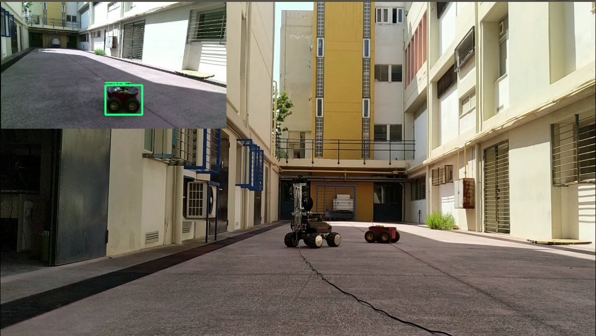

#### Vision Based Leader-Follower Mobile Robot Schema by using MobileNets for Detection and an RGBD-Camera

    

The source code and the experimental videos can be found at my personal [Google Drive](https://drive.google.com/drive/folders/1FQmJPG-sj2xHcH3shPUANIkJkorwxRfR?usp=sharing)

#### Author
Petropoulakis Panagiotis petropoulakispanagiotis@gmail.com

#### Acknowledgements 
Supervisor: [Kostas J. Kyriakopoulos](http://www.controlsystemslab.gr/kkyria/)
   
